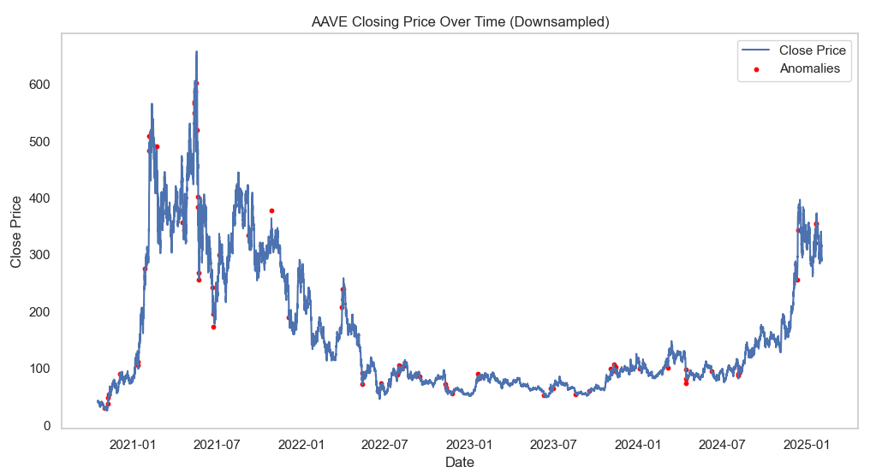
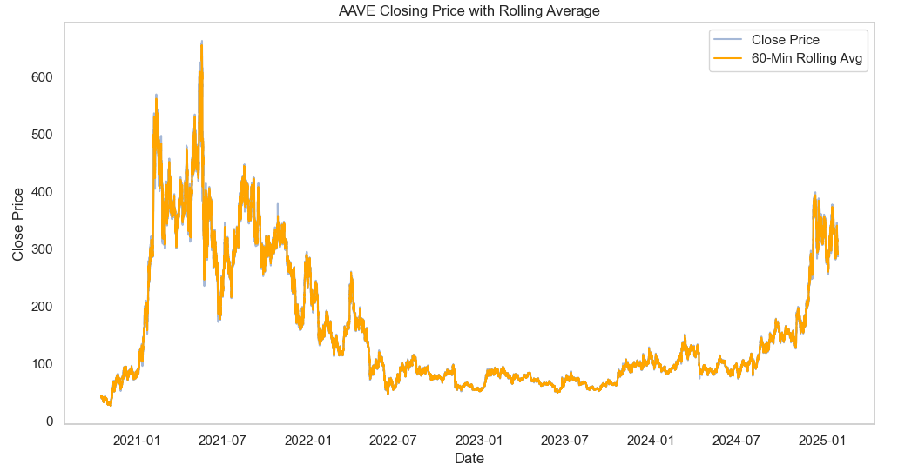
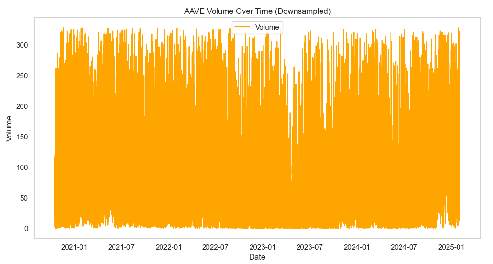
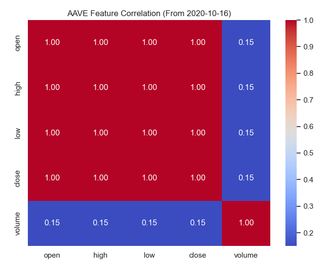

# Advanced Crypto Market Analysis & Ensemble Trading Robot

## Table of Contents
- [Overview](#overview)
- [Data Pipeline](#data-pipeline)
  - [Data Sources & Storage](#data-sources--storage)
  - [Data Cleaning & Feature Engineering](#data-cleaning--feature-engineering)
  - [Handling Large Files](#handling-large-files)
- [Modeling & Strategies](#modeling--strategies)
  - [Technical Indicators](#technical-indicators)
  - [Machine Learning Approaches](#machine-learning-approaches)
  - [Reinforcement Learning (RL)](#reinforcement-learning-rl)
  - [LLM Sentiment Analysis](#llm-sentiment-analysis)
- [Ensemble Strategy](#ensemble-strategy)
  - [Sub-Strategies Merged](#sub-strategies-merged)
  - [Voting vs. Summation](#voting-vs-summation)
- [Backtesting](#backtesting)
  - [Buy and Hold Baseline](#buy-and-hold-baseline)
  - [Performance Metrics](#performance-metrics)
  - [Risk & Drawdown](#risk--drawdown)
- [Results & Interpretation](#results--interpretation)
  - [Accuracy vs. Profitability](#accuracy-vs-profitability)
  - [Comparison with Baseline](#comparison-with-baseline)
  - [Further Considerations](#further-considerations)
- [Dashboard & Visualization](#dashboard--visualization)
- [Images & Graph Analysis](#images--graph-analysis)
  - [Figure 1: Code Execution with Debug Logs](#figure-1-code-execution-with-debug-logs)
  - [Figure 2: Zero-Lag Correlation Matrix](#figure-2-zero-lag-correlation-matrix)
  - [Figure 3: Cross-Correlation Plot](#figure-3-cross-correlation-plot)
  - [Figure 4: Ratio Table and Pivot](#figure-4-ratio-table-and-pivot)
  - [Figure 5: Ensemble vs. Buy & Hold](#figure-5-ensemble-vs-buy--hold)
- [Analysis of `all_pairs_ratios.csv`](#analysis-of-all_pairs_ratioscsv)
  - [Mean Ratio & Pct Inversion](#mean-ratio--pct-inversion)
  - [Implications for Trading](#implications-for-trading)
- [Next Steps](#next-steps)
- [License & Disclaimer](#license--disclaimer)

---

## Overview
This project focuses on creating an **advanced crypto trading robot** that consolidates **multiple data sources**, builds **technical indicators**, employs **machine learning** (including neural networks and reinforcement learning), and combines them via an **ensemble** approach. The overarching goal is to **outperform** (or at least **rival**) a simple buy-and-hold strategy, while also providing a more controlled risk profile.

**Key Achievements:**
- Built a pipeline to handle large files (e.g. a 9 GB `combined_minute_data.csv`).
- Created advanced feature sets (technical, cross-coin ratios, sentiment).
- Tested multiple strategies (classical TA, ML classifiers, RL, LLM-based sentiment).
- Deployed an **ensemble** that merges sub-strategy signals to produce final trading actions.

---

## Data Pipeline

### Data Sources & Storage
- **`combined_minute_data.csv`** (9 GB). Consolidated minute-level data for multiple cryptocurrencies, covering columns like `timestamp`, `symbol`, `Open`, `High`, `Low`, `Close`, `Volume`.  
- **`all_pairs_ratios.csv`**. A file capturing pairwise relationships (mean ratios, inversion percentages) between coins.  
- **`technical_indicator.csv`**. Output from the feature engineering pipeline with advanced TA indicators (RSI, MACD, Bollinger, etc.).

Because `combined_minute_data.csv` is large, we discussed:
- **Chunked reading** in Pandas (using `chunksize`)  
- **Filtering** columns or date ranges if not all data is needed  
- **Possible** format conversions (Parquet or database storage)

---

## EDA for AAVE

Below are some EDA charts and descriptive stats specifically for **AAVE** over a multi-year timeframe (from ~2020-10-16 to 2025-02-01 in minute-level data). We downsampled or highlighted anomalies to keep the charts legible.

### Downsampled Price and Anomalies

- **Red dots** indicate potential anomalies or outliers (massive sudden spikes/dips).
- AAVE price soared to over \$600 in early 2021, then retraced under \$100–\$200 for extended periods.
- We flagged ~69 anomalies where abrupt changes exceeded a threshold.

### Rolling Average

- The **orange** line is a **60-minute rolling average** to smooth short-term volatility.
- Notice the difference between the raw close vs. the smoothed curve at times of high fluctuation.

### Volume Over Time

- Shows minute-level trade volume. Even after removing zero-volume or outlier volumes, the data remains quite noisy.
- Potential data collection artifacts or repeated high volumes might appear consistently.

### Feature Correlation

- Price features (`open, high, low, close`) are essentially **1.0 correlated** with each other in daily or minute data, typical for crypto intraday timescales.
- Volume is less correlated (around ~0.15) with price. That suggests volume fluctuations have some but not an extremely strong relationship with price.

### Detailed Statistics

**Data Shape**: (2260050, 6)  
(**Columns**: `timestamp`, `open`, `high`, `low`, `close`, `volume`)

Data Info & Descriptive Stats

--- EDA for AAVE ---
Data Shape: (2260050, 6)

Data Info:
<class 'pandas.core.frame.DataFrame'>
Index: 2260050 entries, 180 to 2260229
Data columns (total 6 columns):
 #   Column     Dtype
---  ------     -----
 0   timestamp  datetime64[ns]
 1   open       float64
 2   high       float64
 3   low        float64
 4   close      float64
 5   volume     float64
dtypes: datetime64[ns](1), float64(5)
memory usage: 120.7 MB
None

Descriptive Statistics:
                           timestamp          open          high           low         close        volume
count                        2260050  2.260050e+06  2.260050e+06  2.260050e+06  2.260050e+06  2.260050e+06
mean   2022-12-10 14:24:37.190095104  1.592175e+02  1.593899e+02  1.590426e+02  1.592180e+02  1.419901e+02
min              2020-10-16 00:00:00  2.598600e+01  2.598800e+01  2.593900e+01  2.598700e+01  0.000000e+00
25%              2021-11-13 07:37:15  7.770000e+01  7.780000e+01  7.767400e+01  7.770000e+01  1.501500e+01
50%              2022-12-10 16:29:30  1.008400e+02  1.009200e+02  1.007800e+02  1.008500e+02  4.995100e+01
75%              2024-01-07 02:41:45  2.223000e+02  2.226000e+02  2.220300e+02  2.223000e+02  1.367030e+02
max              2025-02-02 11:34:00  6.658900e+02  6.680000e+02  6.640000e+02  6.658900e+02  7.340102e+04
std                              NaN  1.158957e+02  1.160797e+02  1.157076e+02  1.158955e+02  3.673587e+02

Missing Values:
timestamp    0
open         0
high         0
low          0
close        0
volume       0
dtype: int64

Removed 77517 rows with zero volume.
Identified 223663 volume outliers.

Missing Timestamps: 302625
DatetimeIndex(['2020-10-16 00:17:00', '2020-10-16 00:25:00',
               '2020-10-16 00:29:00', '2020-10-16 00:34:00',
               '2020-10-16 00:42:00', '2020-10-16 00:44:00',
               '2020-10-16 00:46:00', '2020-10-16 00:49:00',
               '2020-10-16 00:55:00', '2020-10-16 00:56:00'],
              dtype='datetime64[ns]', freq=None)

Detected 69 potential price anomalies (sudden jumps).

Additional Insights:
Maximum Closing Price: 663.53 on 2021-05-18T21:27:00.000000000
Minimum Closing Price: 25.987 on 2020-11-05T09:04:00.000000000
Average Volume (post-cleaning): 71.44266967430202
**Missing Values**: 0 in each column.  
**Removed** 77,517 rows with zero volume.  
**Identified** 223,663 volume outliers.  
**Missing Timestamps**: 302,625 (irregular sampling or incomplete data).  
**Detected** 69 price anomalies.  
**Max Closing Price**: \$663.53 near 2021-05-18.  
**Min Closing Price**: \$25.987 near 2020-11-05.  
**Average Volume** post-cleaning: ~71.44.  

---

### Data Cleaning & Feature Engineering
We ran scripts to:
1. **Clean** missing/outlier data via robust scalers and imputers.  
2. **Generate** indicators such as RSI, MACD, Bollinger Bands, EMA, and additional price-based features.  
3. **Store** the result in `technical_indicator.csv` for further modeling.

### Handling Large Files
To avoid running out of memory, we:
- Used partial reading in Pandas (`chunksize`).  
- Or limited columns/time windows.  
- In a real environment, we might store data in a local **SQLite** DB or convert to **Parquet** for more efficient repeated queries.

---

## Modeling & Strategies

### Technical Indicators
- We used scripts in `feature_engineering.py` or `data_processing.py` to produce columns like `RSI`, `MACD`, `Bollinger_Bands`, `EMA`, etc.  
- Additional cross-coin ratio features from `all_pairs_ratios.csv` can reveal potential lead-lag relationships or stable spreads.

### Machine Learning Approaches
We tested:
1. **RandomForest**  
2. **XGBoost**  
3. **Logistic Regression**  

These typically used a classification target of **“next-bar up vs. down”** or multi-class signals (buy/hold/sell). Some final accuracies in the ~51–52% range, indicating a modest predictive edge over randomness.

### Reinforcement Learning (RL)
- **`RLAgentStrategy`** uses **stable-baselines3** (PPO) with a minimal environment.  
- It learns discrete actions {0, 1, 2} => mapped to {sell, hold, buy}.  
- The environment is fairly abstract in the example; real usage would define a reward function based on profit or risk metrics.

### LLM Sentiment Analysis
- **`LLMSentimentStrategy`** loads a **Hugging Face** pipeline (e.g. `distilbert-base-uncased-finetuned-sst-2-english`) to classify **news_text** as {POSITIVE, NEGATIVE, NEUTRAL}.  
- Outputs signals: +1, -1, or 0.  
- Great for social-driven markets; requires data with `news_text` by timestamp.

---

## Ensemble Strategy

### Sub-Strategies Merged
`EnsembleStrategy` merges signals from:
- **TimeSeriesNNStrategy** (Keras-based LSTM)  
- **LLMSentimentStrategy** (Hugging Face sentiment)  
- **RLAgentStrategy** (PPO discrete actions)  
- Potentially classical TA or ML classifiers (e.g. RandomForest)

### Voting vs. Summation
- **Majority Vote**: Each sub-strategy outputs -1/0/+1; the final ensemble picks the mode.  
- **Sum**: Summation of signals, then sign => final.  
- In real usage, you might have a **meta-learner** or weighting mechanism if some sub-strategies are more reliable.

---

## Backtesting

### Buy and Hold Baseline
We frequently compare each strategy to a **simple buy-and-hold** on the target coin. Over certain bullish periods, buy-and-hold can yield very high returns, meaning the strategy must show either **higher returns** or **better risk-adjusted** returns to be compelling.

### Performance Metrics
- **Total Return**  
- **Annual Return** (extrapolated from daily or minutely returns)  
- **Volatility** (std dev of daily returns)  
- **Sharpe Ratio**  
- **Max Drawdown**  

### Risk & Drawdown
While some strategies may produce slightly lower returns than buy-and-hold, they can still be **valuable** if they significantly reduce drawdowns or volatility.

---

## Results & Interpretation

### Accuracy vs. Profitability
- ML models ended up around **51–52%** accuracy, which is only slightly above random. However, **small edges** can still yield big profits in highly volatile markets.

### Comparison with Baseline
- One example ensemble test saw a **+628%** return for the strategy vs. **+691%** for buy-and-hold.  
- On raw percentage gains, the ensemble slightly lagged. But if the ensemble had smoother equity curves or better drawdown stats, it could still be “good.”

### Further Considerations
- **Transaction costs** & slippage aren’t accounted for in a naive backtest.  
- The dataset might cover a bull run, so buy-and-hold will appear strong.  
- Tuning hyperparameters or using a **dynamic** approach to pick sub-strategies can further refine results.

---

## Dashboard & Visualization
We built a `StrategyDashboard` that plots:
1. **Portfolio Value** Over Time  
2. **Returns Distribution**  
3. **Drawdown** Curves  
4. **Performance Metric** Bar Charts  

This yields an **at-a-glance** comparison of multiple strategies (e.g., LLM Sentiment, RL Agent, Ensemble, etc.).

---

## Analysis

### Code Execution with Debug Logs

[INFO] Starting data processing pipeline...

[INFO] Loading ETH from ..\data\ETH_minutely_data.csv ...
[DEBUG]  -> Cleaning ETH data ...
[DEBUG]     clean_data() -> handling missing values...
[DEBUG]       -> 0 columns have missing data.
[DEBUG]     clean_data() -> removing outliers...
[DEBUG]       -> Removing outliers with RobustScaler threshold=3
[DEBUG]       -> Found 137912 outliers in column 'Volume'. Setting to NaN.
[DEBUG]       -> Re-imputing after outlier removal
[DEBUG]       -> 1 columns have missing data.
[DEBUG]       -> Using KNNImputer for low-missing columns: ['Volume']

**Analysis:**  
The debug messages confirm each step in `data_processing.py` or `analysis.py` is running, such as:
- Missing value imputation,
- Outlier removal,
- Training/validation split.  
This helps ensure large data sets are handled properly and that we can see any performance bottlenecks.

---

### Zero-Lag Correlation Matrix

Show Image

**Analysis:**  
- Shows how strongly each coin’s `Close` price is correlated with another at **no time shift**.  
- Red blocks along the diagonal = perfect correlation with itself.  
- Pairs with correlation ~0.90 indicate they move closely together.  
- This can reveal if an altcoin is near-duplicate of another, offering less diversification.

---

### Cross-Correlation Plot

**Analysis:**  
- For example, BTC vs. ETH might show a correlation near 0-lag, meaning they move together.  
- If a peak correlation is found at a positive lag, it suggests coin A leads coin B by that many minutes.  
- In the example, no strong lead-lag effect was found except near lag=0, meaning simultaneous moves.

[INFO] Loading data from: data\combined_minute_data.csv
[INFO] Found 14 symbols: ['AAVE', 'ADA', 'AVAX', 'AXS', 'BTC', 'DOT', 'ETH', 'FTM', 'LTC', 'MATIC', 'SAND', 'SOL', 'UNI', 'XLM']

#### Top 20 Pairs in a Markdown Table

| Index | symbol_x | symbol_y | best_lag | best_corr |
|------:|:--------:|:--------:|---------:|----------:|
| 11  | AAVE | UNI  | 0 | 0.928 |
| 156 | UNI  | AAVE | 0 | 0.928 |
| 93  | FTM  | AVAX | 0 | 0.921 |
| 32  | AVAX | FTM  | 0 | 0.921 |
| 12  | AAVE | XLM  | 0 | 0.919 |
| 169 | XLM  | AAVE | 0 | 0.919 |
| 109 | LTC  | DOT  | 0 | 0.914 |
| 72  | DOT  | LTC  | 0 | 0.914 |
| 164 | UNI  | LTC  | 0 | 0.908 |
| 115 | LTC  | UNI  | 0 | 0.908 |
| 76  | DOT  | UNI  | 0 | 0.893 |
| 161 | UNI  | DOT  | 0 | 0.893 |
| 116 | LTC  | XLM  | 0 | 0.871 |
| 177 | XLM  | LTC  | 0 | 0.871 |
| 157 | UNI  | ADA  | 0 | 0.867 |
| 24  | ADA  | UNI  | 0 | 0.867 |
| 7   | AAVE | LTC  | 0 | 0.866 |
| 104 | LTC  | AAVE | 0 | 0.866 |
| 168 | UNI  | XLM  | 0 | 0.862 |
| 181 | XLM  | UNI  | 0 | 0.862 |

**Observations**:
- **AAVE–UNI** and **UNI–AAVE** appear at the top with correlation ~0.928.  
- **FTM–AVAX** also has a strong correlation of ~0.921.  
- All these correlations are measured at **lag=0**, meaning both series move together simultaneously without a consistent time lead/lag.  
- This high correlation might indicate these pairs exhibit very similar market behavior in minute-level data, with minimal potential for lead–lag arbitrage but potential for **pairs-trading** if the ratio is stable.

[INFO] Highest correlation pair: AAVE vs. UNI => Corr=0.928 @ lag=0

[INFO] analysis_lag.py complete.

---

### Ratio Table and Pivot

**Analysis:**  
- Summarizes pairwise mean ratio (`mean_ratio`) of coin X to coin Y and how often X < Y (`pct_inversion`).  
- If `pct_inversion` is near 0, X is almost always above Y; if it’s near 1, X is almost always below Y.  
- These static relationships can feed into a strategy to detect “inversions” that might be buy signals.

---

### Figure: Ensemble vs. Buy & Hold

**Analysis:**  
- Both lines grew significantly, e.g. +600% or more.  
- The buy & hold might edge out the ensemble’s final percentage gain.  
- However, if the ensemble had fewer, shallower drawdowns, it could be more attractive for certain investors.

---

## Analysis of `all_pairs_ratios.csv`

Below is a snippet of the CSV (each row represents `(symbol_x, symbol_y, mean_ratio, std_ratio, pct_inversion)`):

### Full Table

Expand to see all rows

|symbol_x|symbol_y|mean_ratio|std_ratio|pct_inversion|
|---|---|---|---|---|
|AAVE|ADA|245.0704|115.3134|0.0|
|AAVE|AVAX|6.9889|6.1786|0.0|
|AAVE|AXS|33.6286|62.3936|0.0|
|AAVE|BTC|0.0038|0.0022|1.0|
|AAVE|DOT|15.1124|8.5454|0.0|
|AAVE|ETH|0.0714|0.0487|1.0|
|AAVE|FTM|602.7409|1030.8894|0.0|
|AAVE|LTC|1.4396|0.5547|0.2491|
|AAVE|MATIC|571.5172|1325.5416|0.0|
|AAVE|SAND|439.0896|613.9246|0.0|
|AAVE|SOL|6.7783|12.8538|0.1816|
|AAVE|UNI|14.7038|3.843|0.0|
|AAVE|XLM|831.4235|246.0405|0.0|
|ADA|AAVE|0.0047|0.0015|1.0|
|ADA|AVAX|0.0279|0.0215|1.0|
|ADA|AXS|0.1027|0.1255|1.0|
|ADA|BTC|0.0|0.0|1.0|
|ADA|DOT|0.064|0.0231|1.0|
|ADA|ETH|0.0003|0.0002|1.0|
|ADA|FTM|1.9913|2.1276|0.3698|
|ADA|LTC|0.0066|0.0028|1.0|
|ADA|MATIC|1.5347|2.3066|0.7194|
|ADA|SAND|1.5006|1.3833|0.4997|
|ADA|SOL|0.0209|0.0248|1.0|
|ADA|UNI|0.0659|0.0196|1.0|
|ADA|XLM|3.8154|1.3364|0.0203|
|AVAX|AAVE|0.2313|0.1319|1.0|
|AVAX|ADA|48.1123|20.4582|0.0|
|AVAX|AXS|3.8349|3.6057|0.0279|
|AVAX|BTC|0.0008|0.0005|1.0|
|AVAX|DOT|3.104|1.6553|0.1828|
|AVAX|ETH|0.0126|0.006|1.0|
|AVAX|FTM|69.2215|48.8947|0.0|
|AVAX|LTC|0.3141|0.1845|1.0|
|AVAX|MATIC|54.7835|68.41|0.0|
|AVAX|SAND|55.943|35.1914|0.0|
|AVAX|SOL|0.7064|0.6806|0.8728|
|AVAX|UNI|3.2427|1.8958|0.1118|
|AVAX|XLM|189.855|111.9324|0.0|
|AXS|AAVE|0.0948|0.0658|1.0|
|AXS|ADA|18.2685|10.0565|0.0|
|AXS|AVAX|0.4319|0.3652|0.9721|
|AXS|BTC|0.0003|0.0003|1.0|
|AXS|DOT|1.1546|0.5684|0.2662|
|AXS|ETH|0.0053|0.0039|1.0|
|AXS|FTM|25.9058|21.4598|0.0|
|AXS|LTC|0.1266|0.0931|1.0|
|AXS|MATIC|14.877|8.2012|0.0|
|AXS|SAND|17.274|9.1952|0.0|
|AXS|SOL|0.2518|0.1878|0.9927|
|AXS|UNI|1.3104|0.9851|0.3958|
|AXS|XLM|75.6001|49.2108|0.0|
|BTC|AAVE|337.1012|160.0057|0.0|
|BTC|ADA|80362.0195|45844.9022|0.0|
|BTC|AVAX|1883.5268|1234.3331|0.0|
|BTC|AXS|8431.614|11959.7796|0.0|
|BTC|DOT|5293.0743|4069.4384|0.0|
|BTC|ETH|18.8686|6.2474|0.0|
|BTC|FTM|155648.7923|257273.5054|0.0|
|BTC|LTC|454.8211|246.8556|0.0|
|BTC|MATIC|135136.3711|281757.3766|0.0|
|BTC|SAND|117840.5083|133410.6051|0.0|
|BTC|SOL|1561.2685|2750.9484|0.0|
|BTC|UNI|4836.9586|2298.7772|0.0|
|BTC|XLM|278886.079|171120.1614|0.0|
|DOT|AAVE|0.0796|0.0285|1.0|
|DOT|ADA|17.9482|7.8377|0.0|
|DOT|AVAX|0.507|0.4281|0.8172|
|DOT|AXS|2.3588|4.5386|0.7337|
|DOT|BTC|0.0003|0.0002|1.0|
|DOT|ETH|0.0056|0.0042|1.0|
|DOT|FTM|45.4827|80.5161|0.0|
|DOT|LTC|0.1075|0.0453|1.0|
|DOT|MATIC|43.9928|93.7183|0.0|
|DOT|SAND|31.0662|44.5628|0.0|
|DOT|SOL|0.5212|0.9311|0.8796|
|DOT|UNI|1.1172|0.4023|0.4806|
|DOT|XLM|63.211|22.1545|0.0|
|ETH|AAVE|18.8915|8.6562|0.0|
|ETH|ADA|4205.4447|1903.9314|0.0|
|ETH|AVAX|96.8045|42.6265|0.0|
|ETH|AXS|366.4054|367.0756|0.0|
|ETH|BTC|0.0577|0.0149|1.0|
|ETH|DOT|274.648|160.8164|0.0|
|ETH|FTM|6947.3914|7306.1132|0.0|
|ETH|LTC|24.6629|10.2366|0.0|
|ETH|MATIC|5333.0502|8363.176|0.0|
|ETH|SAND|5349.4222|4123.8653|0.0|
|ETH|SOL|68.8935|80.5218|0.0|
|ETH|UNI|262.3436|103.7377|0.0|
|ETH|XLM|15403.7123|7970.8544|0.0|
|FTM|AAVE|0.0042|0.0026|1.0|
|FTM|ADA|0.8688|0.4779|0.6301|
|FTM|AVAX|0.0177|0.006|1.0|
|FTM|AXS|0.0596|0.0422|1.0|
|FTM|BTC|0.0|0.0|1.0|
|FTM|DOT|0.057|0.0373|1.0|
|FTM|ETH|0.0002|0.0001|1.0|
|FTM|LTC|0.0057|0.0036|1.0|
|FTM|MATIC|0.6912|0.4574|0.7618|
|FTM|SAND|0.9303|0.5947|0.7096|
|FTM|SOL|0.0104|0.0064|1.0|
|FTM|UNI|0.0582|0.0362|1.0|
|FTM|XLM|3.5162|2.2933|0.1612|
|LTC|AAVE|0.8032|0.3114|0.7509|
|LTC|ADA|193.2274|119.9003|0.0|
|LTC|AVAX|5.3893|5.7215|0.0|
|LTC|AXS|24.8903|50.3303|0.0|
|LTC|BTC|0.0028|0.0012|1.0|
|LTC|DOT|11.0057|4.2735|0.0|
|LTC|ETH|0.0516|0.0319|1.0|
|LTC|FTM|525.2822|1157.5922|0.0|
|LTC|MATIC|496.5914|1238.2497|0.0|
|LTC|SAND|332.8891|561.6222|0.0|
|LTC|SOL|5.7597|12.3339|0.3175|
|LTC|UNI|11.3601|4.5326|0.0|
|LTC|XLM|623.9404|187.7007|0.0|
|MATIC|AAVE|0.0077|0.0043|1.0|
|MATIC|ADA|1.5254|0.8568|0.2805|
|MATIC|AVAX|0.0363|0.0239|1.0|
|MATIC|AXS|0.0917|0.0603|1.0|
|MATIC|BTC|0.0|0.0|1.0|
|MATIC|DOT|0.0947|0.053|1.0|
|MATIC|ETH|0.0004|0.0002|1.0|
|MATIC|FTM|2.072|1.2038|0.2381|
|MATIC|LTC|0.0093|0.0044|1.0|
|MATIC|SAND|1.4492|0.9293|0.3384|
|MATIC|SOL|0.022|0.017|1.0|
|MATIC|UNI|0.1016|0.0543|1.0|
|MATIC|XLM|6.0368|3.3196|0.1303|
|SAND|AAVE|0.0058|0.0043|1.0|
|SAND|ADA|1.1461|0.6854|0.5003|
|SAND|AVAX|0.0251|0.0142|1.0|
|SAND|AXS|0.0675|0.0243|1.0|
|SAND|BTC|0.0|0.0|1.0|
|SAND|DOT|0.0718|0.0406|1.0|
|SAND|ETH|0.0003|0.0002|1.0|
|SAND|FTM|1.5734|0.9968|0.2904|
|SAND|LTC|0.0075|0.0058|1.0|
|SAND|MATIC|0.9657|0.6101|0.6616|
|SAND|SOL|0.0164|0.0118|1.0|
|SAND|UNI|0.0804|0.0618|1.0|
|SAND|XLM|4.5387|3.1185|0.1312|
|SOL|AAVE|0.5769|0.4704|0.8183|
|SOL|ADA|128.7|121.9149|0.0|
|SOL|AVAX|2.4372|1.6921|0.127|
|SOL|AXS|9.4382|10.3846|0.0073|
|SOL|BTC|0.0016|0.001|1.0|
|SOL|DOT|9.5223|10.716|0.1204|
|SOL|ETH|0.0287|0.0188|1.0|
|SOL|FTM|135.8761|81.3558|0.0|
|SOL|LTC|0.8503|0.7484|0.6825|
|SOL|MATIC|85.8872|76.124|0.0|
|SOL|SAND|152.1065|169.9763|0.0|
|SOL|UNI|8.2586|6.7495|0.1183|
|SOL|XLM|512.0161|493.8627|0.0|
|UNI|AAVE|0.0722|0.0167|1.0|
|UNI|ADA|16.6503|5.4416|0.0|
|UNI|AVAX|0.4691|0.3741|0.8882|
|UNI|AXS|2.0116|3.2111|0.6041|
|UNI|BTC|0.0003|0.0002|1.0|
|UNI|DOT|1.0139|0.3616|0.5186|
|UNI|ETH|0.0049|0.0031|1.0|
|UNI|FTM|37.0616|50.4212|0.0|
|UNI|LTC|0.0994|0.0315|1.0|
|UNI|MATIC|33.2508|66.2535|0.0|
|UNI|SAND|27.2926|31.3824|0.0|
|UNI|SOL|0.4184|0.6615|0.8817|
|UNI|XLM|59.0687|18.1638|0.0|
|XLM|AAVE|0.0013|0.0004|1.0|
|XLM|ADA|0.3175|0.1891|0.9797|
|XLM|AVAX|0.0092|0.0095|1.0|
|XLM|AXS|0.0452|0.0907|1.0|
|XLM|BTC|0.0|0.0|1.0|
|XLM|DOT|0.0188|0.0104|1.0|
|XLM|ETH|0.0001|0.0001|1.0|
|XLM|FTM|0.8905|1.8875|0.8388|
|XLM|LTC|0.0018|0.0006|1.0|
|XLM|MATIC|0.8535|2.0886|0.8697|
|XLM|SAND|0.5856|0.9701|0.8688|
|XLM|SOL|0.0098|0.0206|1.0|
|XLM|UNI|0.0191|0.0078|1.0|

### Mean Ratio & Pct Inversion
1. **`mean_ratio`**: If `X / Y = mean_ratio >> 1`, it means symbol X’s price is typically far higher than symbol Y’s in **raw** USD terms. For instance, if `mean_ratio = 245.07` for `(AAVE, ADA)`, that means on average, AAVE is about 245× more expensive than ADA.  
2. **`pct_inversion`**: The fraction of rows (in some historical dataset) where `X` is **below** `Y`. A `0.0` implies X was **never** cheaper than Y. A `1.0` means X was **always** cheaper. Values like `0.2491` means ~24.91% of the time X dips under Y.  
3. **Observing extremes**:  
   - For `(AAVE, BTC)`, `mean_ratio=0.0038` with `pct_inversion=1.0`. This suggests AAVE is always cheaper than BTC in raw price, and it never inverts.  
   - For `(BTC, ADA)`, `mean_ratio=80362.0195`, `pct_inversion=0.0`. That means 0% of the time is BTC < ADA, which is logical: BTC is typically tens of thousands of USD, while ADA is under a dollar.

### Implications for Trading
- **No Inversions** (`pct_inversion=0.0`): If X is **always** above Y in price, there is no crossover event to exploit, so a “buy X if it dips below Y” logic never triggers.  
- **Rare Inversions** (`pct_inversion` near **0.0** but not zero): Might be interesting if X occasionally dips below Y for short windows. A strategy could buy X each time that rare inversion happens, expecting it to revert.  
- **Volatility** (`std_ratio`) can indicate how stable that ratio is. For example, `AAVE vs. MATIC` has a large standard deviation (1325.5416), meaning the ratio can swing widely. Even if mean is high, it’s not stable.  
- **Arbitrage / Pairs Trading**: Typically requires cointegration or stable ratio over time. A high mean ratio alone doesn’t guarantee reversion unless the ratio is proven stationary.

Hence, `all_pairs_ratios.csv` provides a **static** view of average relationships between coin prices. You can incorporate it as **additional features** (like “mean ratio to BTC” or “% of time X < Y” as a signal) into a multi-coin or cross-coin strategy.

---

## Next Steps
1. **Parameter Tuning**: Use grid search for XGBoost, RF, or neural net hyperparams.  
2. **Cointegration & Cross-Symbol**: For altcoins, check stable ratio or lead-lag effects.  
3. **Stop-Loss / Risk Control**: Implement advanced position sizing or risk management.  
4. **GPU Acceleration**: For large neural nets or XGBoost with `'gpu_hist'`, if the environment is set up.  
5. **Production Deployment**: Possibly connect to a real exchange API (Binance, etc.) with a live trading bot or paper trading environment.

---

## License & Disclaimer
- **License**: This repository is shared for educational or demonstration purposes; license details can be found in `[LICENSE.md]`.
- **Disclaimer**: Trading cryptocurrencies involves substantial risk. Past performance (including backtest results) does **not** guarantee future returns. Always perform due diligence and never risk funds you can’t afford to lose.
