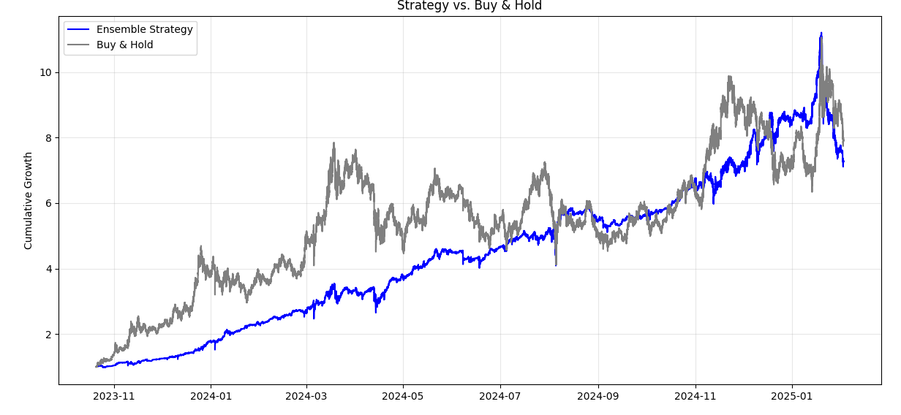

# Advanced Crypto Market Analysis & Ensemble Trading Robot

## Table of Contents
- [Overview](#overview)
- [Data Pipeline](#data-pipeline)
  - [Data Sources & Storage](#data-sources--storage)
  - [Data Cleaning & Feature Engineering](#data-cleaning--feature-engineering)
  - [Handling Large Files](#handling-large-files)
- [Modeling & Strategies](#modeling--strategies)
  - [Technical Indicators](#technical-indicators)
  - [Machine Learning Approaches](#machine-learning-approaches)
  - [Reinforcement Learning (RL)](#reinforcement-learning-rl)
  - [LLM Sentiment Analysis](#llm-sentiment-analysis)
- [Ensemble Strategy](#ensemble-strategy)
  - [Sub-Strategies Merged](#sub-strategies-merged)
  - [Voting vs. Summation](#voting-vs-summation)
- [Backtesting](#backtesting)
  - [Buy and Hold Baseline](#buy-and-hold-baseline)
  - [Performance Metrics](#performance-metrics)
  - [Risk & Drawdown](#risk--drawdown)
- [Results & Interpretation](#results--interpretation)
  - [Accuracy vs. Profitability](#accuracy-vs-profitability)
  - [Comparison with Baseline](#comparison-with-baseline)
  - [Further Considerations](#further-considerations)
- [Dashboard & Visualization](#dashboard--visualization)
- [Images & Graph Analysis](#images--graph-analysis)
  - [Figure 1: Code Execution with Debug Logs](#figure-1-code-execution-with-debug-logs)
  - [Figure 2: Zero-Lag Correlation Matrix](#figure-2-zero-lag-correlation-matrix)
  - [Figure 3: Cross-Correlation Plot](#figure-3-cross-correlation-plot)
  - [Figure 4: Ratio Table and Pivot](#figure-4-ratio-table-and-pivot)
  - [Figure 5: Ensemble vs. Buy & Hold](#figure-5-ensemble-vs-buy--hold)
- [Analysis of `all_pairs_ratios.csv`](#analysis-of-all_pairs_ratioscsv)
  - [Mean Ratio & Pct Inversion](#mean-ratio--pct-inversion)
  - [Implications for Trading](#implications-for-trading)
- [Next Steps](#next-steps)
- [License & Disclaimer](#license--disclaimer)

---

## Overview
This project focuses on creating an **advanced crypto trading robot** that consolidates **multiple data sources**, builds **technical indicators**, employs **machine learning** (including neural networks and reinforcement learning), and combines them via an **ensemble** approach. The overarching goal is to **outperform** (or at least **rival**) a simple buy-and-hold strategy, while also providing a more controlled risk profile.

**Key Achievements:**
- Built a pipeline to handle large files (e.g. a 9 GB `combined_minute_data.csv`).
- Created advanced feature sets (technical, cross-coin ratios, sentiment).
- Tested multiple strategies (classical TA, ML classifiers, RL, LLM-based sentiment).
- Deployed an **ensemble** that merges sub-strategy signals to produce final trading actions.

---

## Data Pipeline

### Data Sources & Storage
- **`combined_minute_data.csv`** (9 GB). Consolidated minute-level data for multiple cryptocurrencies, covering columns like `timestamp`, `symbol`, `Open`, `High`, `Low`, `Close`, `Volume`.  
- **`all_pairs_ratios.csv`**. A file capturing pairwise relationships (mean ratios, inversion percentages) between coins.  
- **`technical_indicator.csv`**. Output from the feature engineering pipeline with advanced TA indicators (RSI, MACD, Bollinger, etc.).

Because `combined_minute_data.csv` is large, we discussed:
- **Chunked reading** in Pandas (using `chunksize`)  
- **Filtering** columns or date ranges if not all data is needed  
- **Possible** format conversions (Parquet or database storage)

### Data Cleaning & Feature Engineering
We ran scripts to:
1. **Clean** missing/outlier data via robust scalers and imputers.  
2. **Generate** indicators such as RSI, MACD, Bollinger Bands, EMA, and additional price-based features.  
3. **Store** the result in `technical_indicator.csv` for further modeling.

### Handling Large Files
To avoid running out of memory, we:
- Used partial reading in Pandas (`chunksize`).  
- Or limited columns/time windows.  
- In a real environment, we might store data in a local **SQLite** DB or convert to **Parquet** for more efficient repeated queries.

---

## Modeling & Strategies

### Technical Indicators
- We used scripts in `feature_engineering.py` or `data_processing.py` to produce columns like `RSI`, `MACD`, `Bollinger_Bands`, `EMA`, etc.  
- Additional cross-coin ratio features from `all_pairs_ratios.csv` can reveal potential lead-lag relationships or stable spreads.

### Machine Learning Approaches
We tested:
1. **RandomForest**  
2. **XGBoost**  
3. **Logistic Regression**  

These typically used a classification target of **“next-bar up vs. down”** or multi-class signals (buy/hold/sell). Some final accuracies in the ~51–52% range, indicating a modest predictive edge over randomness.

### Reinforcement Learning (RL)
- **`RLAgentStrategy`** uses **stable-baselines3** (PPO) with a minimal environment.  
- It learns discrete actions {0, 1, 2} => mapped to {sell, hold, buy}.  
- The environment is fairly abstract in the example; real usage would define a reward function based on profit or risk metrics.

### LLM Sentiment Analysis
- **`LLMSentimentStrategy`** loads a **Hugging Face** pipeline (e.g. `distilbert-base-uncased-finetuned-sst-2-english`) to classify **news_text** as {POSITIVE, NEGATIVE, NEUTRAL}.  
- Outputs signals: +1, -1, or 0.  
- Great for social-driven markets; requires data with `news_text` by timestamp.

---

## Ensemble Strategy

### Sub-Strategies Merged
`EnsembleStrategy` merges signals from:
- **TimeSeriesNNStrategy** (Keras-based LSTM)  
- **LLMSentimentStrategy** (Hugging Face sentiment)  
- **RLAgentStrategy** (PPO discrete actions)  
- Potentially classical TA or ML classifiers (e.g. RandomForest)

### Voting vs. Summation
- **Majority Vote**: Each sub-strategy outputs -1/0/+1; the final ensemble picks the mode.  
- **Sum**: Summation of signals, then sign => final.  
- In real usage, you might have a **meta-learner** or weighting mechanism if some sub-strategies are more reliable.

---

## Backtesting

### Buy and Hold Baseline
We frequently compare each strategy to a **simple buy-and-hold** on the target coin. Over certain bullish periods, buy-and-hold can yield very high returns, meaning the strategy must show either **higher returns** or **better risk-adjusted** returns to be compelling.

### Performance Metrics
- **Total Return**  
- **Annual Return** (extrapolated from daily or minutely returns)  
- **Volatility** (std dev of daily returns)  
- **Sharpe Ratio**  
- **Max Drawdown**  

### Risk & Drawdown
While some strategies may produce slightly lower returns than buy-and-hold, they can still be **valuable** if they significantly reduce drawdowns or volatility.

---

## Results & Interpretation

### Accuracy vs. Profitability
- ML models ended up around **51–52%** accuracy, which is only slightly above random. However, **small edges** can still yield big profits in highly volatile markets.

### Comparison with Baseline
- One example ensemble test saw a **+628%** return for the strategy vs. **+691%** for buy-and-hold.  
- On raw percentage gains, the ensemble slightly lagged. But if the ensemble had smoother equity curves or better drawdown stats, it could still be “good.”

### Further Considerations
- **Transaction costs** & slippage aren’t accounted for in a naive backtest.  
- The dataset might cover a bull run, so buy-and-hold will appear strong.  
- Tuning hyperparameters or using a **dynamic** approach to pick sub-strategies can further refine results.

---

## Dashboard & Visualization
We built a `StrategyDashboard` that plots:
1. **Portfolio Value** Over Time  
2. **Returns Distribution**  
3. **Drawdown** Curves  
4. **Performance Metric** Bar Charts  

This yields an **at-a-glance** comparison of multiple strategies (e.g., LLM Sentiment, RL Agent, Ensemble, etc.).

---

## Images & Graph Analysis

### Figure 1: Code Execution with Debug Logs

Show Image

**Analysis:**  
The debug messages confirm each step in `data_processing.py` or `analysis.py` is running, such as:
- Missing value imputation,
- Outlier removal,
- Training/validation split.  
This helps ensure large data sets are handled properly and that we can see any performance bottlenecks.

---

### Figure 2: Zero-Lag Correlation Matrix

Show Image

**Analysis:**  
- Shows how strongly each coin’s `Close` price is correlated with another at **no time shift**.  
- Red blocks along the diagonal = perfect correlation with itself.  
- Pairs with correlation ~0.90 indicate they move closely together.  
- This can reveal if an altcoin is near-duplicate of another, offering less diversification.

---

### Figure 3: Cross-Correlation Plot

Show Image

**Analysis:**  
- For example, BTC vs. ETH might show a correlation near 0-lag, meaning they move together.  
- If a peak correlation is found at a positive lag, it suggests coin A leads coin B by that many minutes.  
- In the example, no strong lead-lag effect was found except near lag=0, meaning simultaneous moves.

---

### Figure 4: Ratio Table and Pivot

Show Image

**Analysis:**  
- Summarizes pairwise mean ratio (`mean_ratio`) of coin X to coin Y and how often X < Y (`pct_inversion`).  
- If `pct_inversion` is near 0, X is almost always above Y; if it’s near 1, X is almost always below Y.  
- These static relationships can feed into a strategy to detect “inversions” that might be buy signals.

---

### Figure 5: Ensemble vs. Buy & Hold

Show Image

**Analysis:**  
- Both lines grew significantly, e.g. +600% or more.  
- The buy & hold might edge out the ensemble’s final percentage gain.  
- However, if the ensemble had fewer, shallower drawdowns, it could be more attractive for certain investors.

---

## Analysis of `all_pairs_ratios.csv`

Below is a snippet of the CSV (each row represents `(symbol_x, symbol_y, mean_ratio, std_ratio, pct_inversion)`):

### Mean Ratio & Pct Inversion
1. **`mean_ratio`**: If `X / Y = mean_ratio >> 1`, it means symbol X’s price is typically far higher than symbol Y’s in **raw** USD terms. For instance, if `mean_ratio = 245.07` for `(AAVE, ADA)`, that means on average, AAVE is about 245× more expensive than ADA.  
2. **`pct_inversion`**: The fraction of rows (in some historical dataset) where `X` is **below** `Y`. A `0.0` implies X was **never** cheaper than Y. A `1.0` means X was **always** cheaper. Values like `0.2491` means ~24.91% of the time X dips under Y.  
3. **Observing extremes**:  
   - For `(AAVE, BTC)`, `mean_ratio=0.0038` with `pct_inversion=1.0`. This suggests AAVE is always cheaper than BTC in raw price, and it never inverts.  
   - For `(BTC, ADA)`, `mean_ratio=80362.0195`, `pct_inversion=0.0`. That means 0% of the time is BTC < ADA, which is logical: BTC is typically tens of thousands of USD, while ADA is under a dollar.

### Implications for Trading
- **No Inversions** (`pct_inversion=0.0`): If X is **always** above Y in price, there is no crossover event to exploit, so a “buy X if it dips below Y” logic never triggers.  
- **Rare Inversions** (`pct_inversion` near **0.0** but not zero): Might be interesting if X occasionally dips below Y for short windows. A strategy could buy X each time that rare inversion happens, expecting it to revert.  
- **Volatility** (`std_ratio`) can indicate how stable that ratio is. For example, `AAVE vs. MATIC` has a large standard deviation (1325.5416), meaning the ratio can swing widely. Even if mean is high, it’s not stable.  
- **Arbitrage / Pairs Trading**: Typically requires cointegration or stable ratio over time. A high mean ratio alone doesn’t guarantee reversion unless the ratio is proven stationary.

Hence, `all_pairs_ratios.csv` provides a **static** view of average relationships between coin prices. You can incorporate it as **additional features** (like “mean ratio to BTC” or “% of time X < Y” as a signal) into a multi-coin or cross-coin strategy.

---

## Next Steps
1. **Parameter Tuning**: Use grid search for XGBoost, RF, or neural net hyperparams.  
2. **Cointegration & Cross-Symbol**: For altcoins, check stable ratio or lead-lag effects.  
3. **Stop-Loss / Risk Control**: Implement advanced position sizing or risk management.  
4. **GPU Acceleration**: For large neural nets or XGBoost with `'gpu_hist'`, if the environment is set up.  
5. **Production Deployment**: Possibly connect to a real exchange API (Binance, etc.) with a live trading bot or paper trading environment.

---

## License & Disclaimer
- **License**: This repository is shared for educational or demonstration purposes; license details can be found in `[LICENSE.md]`.
- **Disclaimer**: Trading cryptocurrencies involves substantial risk. Past performance (including backtest results) does **not** guarantee future returns. Always perform due diligence and never risk funds you can’t afford to lose.
